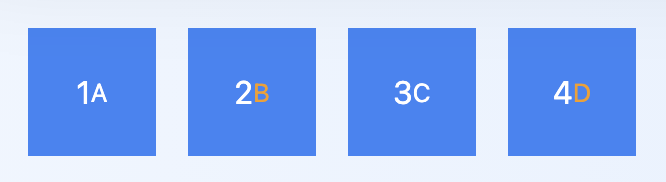

# tailwind-group-even-odd
plugin for tailwind to style sub element in even or odd element

## Install
1. install package

```bash
npm install tailwind-group-even-odd --save
```

2. Add it to your `tailwind.config.js` file:

```js
// tailwind.config.js
module.exports = {
  plugins: [
    require('tailwind-group-even-odd')
  ]
}
```

3. Activate it to add the new variants to the plugins
    * group-even
    * group-odd


## Example

Make the text in the small text yellow for the even childs
```js
// tailwind.config.js
module.exports = {
  ...
  variants: {
    extend: {
        textColor: ['group-even', 'group-odd']
    }
  },
  plugins: [
    require('tailwind-group-even-odd')
  ]
  ....
}
```

HTML input
```html

<div class="overflow-hidden bg-gradient-to-r from-blue-50 to-blue-100 p-4">
  <div class="flex flex-row space-x-4">
    <div class="group w-16 h-16  bg-blue-500 text-white flex items-center justify-center">
      <h3>1</h3>
      <small class="group-even:text-yellow-500">A</small>
    </div>
    <div class="group w-16 h-16  bg-blue-500 text-white flex items-center justify-center ">
      <h3>2</h3>
      <small class="group-even:text-yellow-500">B</small>
    </div>
    <div class="group w-16 h-16  bg-blue-500 text-white flex items-center justify-center ">
      <h3>3</h3>
      <small class="group-even:text-yellow-500">C</small>
    </div>
    <div class="group w-16 h-16 r bg-blue-500 text-white flex items-center justify-center">
      <h3>4</h3>
      <small class="group-even:text-yellow-500">D</small>
    </div>
  </div>
</div>
```

HTML output
